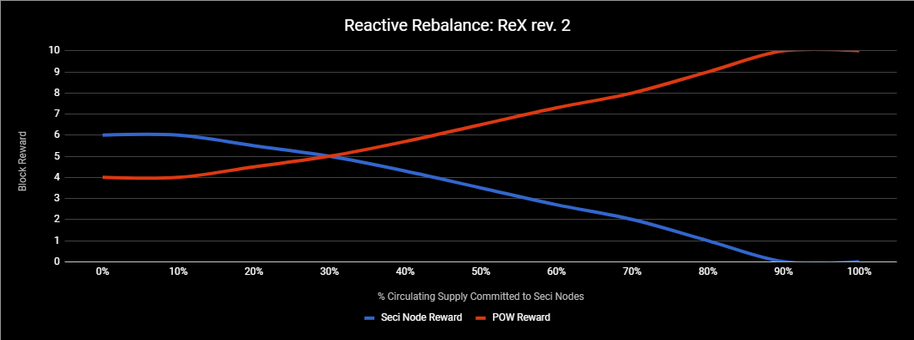

## SECI: Latin; To aim/reach after/strive for/make for/seek

### Technical Specifcations:
__________________________________________________________________________

###### Block Size: 4 MB
###### Max Block Size Serialized Size: 16 MB
###### Proof-of-Work Algorithm: Lyra2rev2
###### Block Time: ~60 seconds
###### Coin Maturity: 100 blocks
###### Transactions Per Second: 133 (Bitcoin: 3, Bitcoin Cash: 27, Dash: 13)
###### Transactions Per 24 hours: 11,520,000
###### Difficulty Retargeting: D106 Algorithm
###### Maximum Coin Supply: 150 Million
###### Treasury Funding: 5% Per Block
###### SegWit: Active
###### SegWit2x: Active
###### SegWit4x: Active
###### Lightning Network: Compatible
###### Atomic Swaps: Compatible
###### Masternodes: Enabled
###### Masternodes Collateral: 30,000 SECI
###### Masternode Reward: Reactive Rebalancing Algorithm ReX rev.2
###### ZSIP: Zero Start Instamine Protection [10 Days: 14440 Blocks]

__________________________________________________________________________

## Seci is an open source, decentralized, community driven digital currency committed to ASIC resistance and building value with blockchain-based products and services. 

### SeciPay
SeciPay is an integrated payment gateway for online commerce that will eliminate the need for payment processors, merchants, and brokers by allowing users to purchase goods and services directly on the website with their cryptocurrency wallet.

Initially, SeciPay will be implemented for the Wordpress platform via WooCommerce. Wordpress dominates the market share for content management systems (58.9% of market) and boasts a staggering 26.9% market share of all websites online.

Woocommerce integration will be followed by plugins for common donation, form, and membership platforms, such as Gravity Forms, targeting charities and businesses that do not utilize full e-commerce solutions but still require additional information with their products, services, or signups.

While Seci will be the initial currency of choice, we will soon thereafter integrate other mainstream currencies that can be accepted on any platform utilizing SeciPay.

The SeciPay roadmap continues, with integration into other e-commerce platforms such as Shopify, Magento, and others based on market share.

A SeciPay application will be available on all platforms for users to easily adopt Seci into their daily lives and easily transact with Seci, benefiting from its technologies.

### Seci Blockchain Services
Seci has the ability to host dedicated and/or application-specific side chains to provide services and applications while sharing the Seci Network's POW Pool and SeciNodes (Masternodes). Seci Blockchain Services are competitive with other commercial blockchain services, such as Microsoft Azure Blockchain Services and Ripple Labs xVia and xCurrent solutions, allowing Seci to provide:

- Commercial Public Ledgers
- Commercial Private Ledgers
- Public and Private Financial and Capital Service Applications
- Supply Chain Applications

In addition to commercial applications, Seci Blockchain Services can be used to provide public services as well, such as a public side chain that is used to track and certify election results, or a side chain providing public or private messaging services, and many other applications.

Unlike other commercial and private Blockchain applications, such as those offered by Ripple Labs, Seci Blockchain Services ties commercial and private blockchain applications back to the main chain and rewards members of the Seci network by charging side chains a service fee in the form of a “Toll”.

The Blockchain Service Tolls are paid in the form of Seci coins, either directly or via an atomic swap of another currency. These tolls are then distributed to members of the Seci network (SeciNodes and Miners) in the form of additional rewards. This ensures Seci’s commercial offerings generate demand and usage for the Seci coin, and directly rewards members of the Seci network for hosting these applications.

More information and technical specifications of the toll system and side chain creation will be released in a separate white paper as development continues.
  
### SeciBusiness
The Seci Team aims to make the integration and management of Seci and it’s products painless and simple. SeciBusiness will make this possible.

Outside the release of separate open-source products, Seci will be releasing a deployment management application for business users to manage their Seci products and monitor the performance and statistics of their Seci integrations. This app management and business intelligence platform will help companies be more efficient, improve their bottom line, and continue to grow.

SeciBusiness is slated for initial release as per the roadmap and will be the hub for Seci product management, business intelligence, and analytics as the Seci platform and ecosystem continues to expand, adding new products and services.
  
### Reactive Rebalance Algorithm: ReX rev.2
To ensure long-term network stability, protect the ROI of SeciNode holders and miners, and to assist in stabilization of price and market volumes via buy and sell pressure on the markets, Seci makes use of a Reactive Rebalancing Algorithm: ReX rev. 2. This technology shifts incentives toward network and market health via variable rewards. 

The Seci Network will dynamically alter the block reward and Blockchain Service Toll splits between miners and SeciNode holders. At the commitment Target, rewards will be split equally between SeciNodes and Miners, if the number of SeciNodes falls below the target, the reward split will rebalance, increasing the SeciNode reward to 60% of the block reward. This increases ROI and puts buy pressure on the market. If the Seci Network becomes overly saturated with SeciNodes, the reward split will rebalance all the way down to 0% (at 90% circulating supply), putting sell pressure on the market.

This process incentivizes a healthy stability of committed circulating supply and market volumes, protecting miner and SeciNode holder returns alike.

### ASIC Resistance
Seci is committed to a truly distributed platform. As such, the Seci team is committed to maintaining ASIC resistance. If any ASIC mining devices are released that are compatible with the current Seci POW algorithm, Seci has the capability of modifying parameters that will break ASIC compatibility. If necessary, the Seci team is also prepared to change the POW algorithm entirely.

**See our Website and white paper for more information**

## Links

- **[SECI Website](https://seci.io)**
- **[SECI Explorer](https://explorer.seci.io)**
- **[SECI Discord](https://discord.gg/2paXqUk)**
- **[SECI Reddit](https://www.reddit.com/r/SECI-coin)**
- **[SECI Twitter](https://twitter.com/SECIproject)**
- **[SECI GitHub](https://github.com/seci-coin)**

## SECI Team

- **Hamrex (hamrex@seci.io) - Lead Developer & Business Development**
- **Nect (nect@seci.io) - Developer & Business Development**
- **Soepchick (soepchick@seci.io) - Lead Web Developer, Lead PR & Marketing**

__________________________________________________________________________

## Building on Ubuntu / Debian

### Install Dependencies

    sudo apt-get update
    sudo apt-get upgrade //Optional
    sudo apt-get install build-essential
    sudo apt-get install libtool autotools-dev autoconf automake
    sudo apt-get install libssl-dev libevent-dev
    sudo apt-get install libboost-all-dev
    sudo apt-get install pkg-config
    sudo add-apt-repository ppa:bitcoin/bitcoin
    sudo apt-get update
    sudo apt-get install libdb4.8-dev
    sudo apt-get install libdb4.8++-dev
    sudo apt-get install libminiupnpc-dev
    sudo apt-get install libqt4-dev libprotobuf-dev protobuf-compiler //Optional, but required to build GUI Wallet
    sudo apt-get install libqt5gui5 libqt5core5a libqt5dbus5 qttools5-dev qttools5-dev-tools libprotobuf-dev //Optional, but required to build GUI Wallet
    sudo apt-get install libqrencode-dev //Optional

### Clone the Repo and Build Seci

    git clone https://github.com/seci-coin/seci
    cd seci
    ./autogen.sh
    ./configure
    make

__________________________________________________________________________
